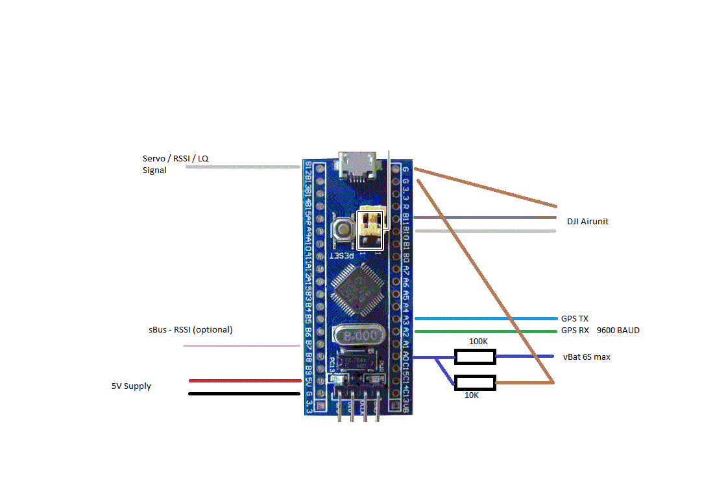

Based on https://github.com/d3ngit/djihdfpv_mavlink_to_msp_V2

#DJI HD FPV Telemetry to MSP - OSD for DJI firmware version V01.00.0500

Converts GPS, RSSI - Servo and vBat as telemetry data to MSP telemetry data compatible with the DJI HD FPV system.
# 
NOT FLY-TESTED YET !!!!

Groundtests look OK.
=======
# 
 TX to DJI Air unit RX(115200)
#
 Hardware recomended - Blue Pill STM32
=======

